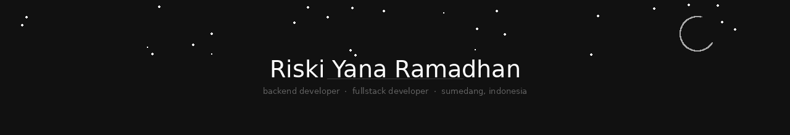

  
  &nbsp;
  
  &nbsp;

 

backend-focused developer with fullstack background.  
interested in server-side architecture, api design, and database systems.  
building with **node.js · express.js · typescript · postgresql**

 

## tech stack

 

## projects

| project | stack | description |
|---|---|---|
| **POS Web Application** | Node.js · PostgreSQL | product, transaction, inventory & role-based access |
| **Todo App with Auth** | Express · TypeScript | auth, profile management, pagination & filtering |
| **REST API Projects** | Node.js · Sequelize | crud api with clean architecture & endpoint design |

 

## stats

  
  

 

  

 

  <i>"kedalaman tidak harus berisik. kadang ia hanya berdiri di sana—rapi, sunyi, dan tegas dalam batasnya sendiri."</i>

 

## contact

&nbsp;

&nbsp;

